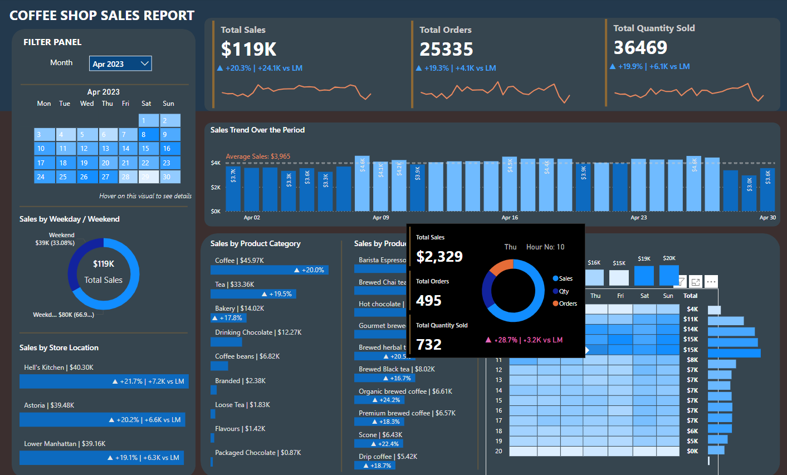

# coffee-shop-sales-report-dashboard

## Overview
This Power BI dashboard is designed to provide a detailed analysis of sales performance for a coffee shop chain. It incorporates various metrics to offer a comprehensive overview of sales data across different time frames and product categories. The dashboard helps in identifying trends, peak sales hours, and top-performing products, which are crucial for strategic business decisions.

## Key Features
### Summary Dashboard
* Total Sales and Orders Overview: Displays the total sales, number of orders, and total quantity sold, with month-over-month comparison.
* Sales Trends Over the Period: Shows daily sales for the month, helping to identify peak days and analyze weekly trends.
* Sales by Weekday/Weekend: Compares sales performance between weekdays and weekends to optimize staffing and inventory.
* Sales by Product Category and Type: Breaks down sales by different product categories (like Coffee, Tea, Bakery) and types (e.g., Barista Espresso, Brewed Chai Tea), highlighting which items contribute most to the revenue.
* Sales by Days and Hours: Analyzes sales distribution across different days of the week and hours of the day, pinpointing peak business hours.
### Interactive Tooltips
* Calendar Chart Tooltip: Provides a quick snapshot of sales, orders, and quantity for any selected day, offering deeper insight into daily performance.

  
  
* Hourly Sales Tooltip: Delivers specific details about sales, orders, and quantity for each hour, useful for identifying the most lucrative hours and planning operational hours accordingly.

  
  
### Data Insights
* Sales Performance Tracking: Monitors sales growth and identifies successful product lines and time periods with high customer engagement.
* Operational Adjustments: Insights from the hourly data and weekday/weekend sales can inform staffing decisions and promotional strategies to maximize revenue.
* Product Analysis: Detailed breakdowns by product type allow for fine-tuning of stock levels and development of targeted marketing campaigns for best-selling items.

### Tools Used
* MySQL: For storing and querying sales data.
* Power BI: For data visualization and exploratory data analysis (EDA).

### Conclusion
The Coffee Shop Sales Analysis dashboard provides valuable insights into the sales performance of the coffee shop. By understanding key metrics and trends, the company can make data-driven decisions to enhance sales strategies, improve product offerings, and optimize overall performance.
